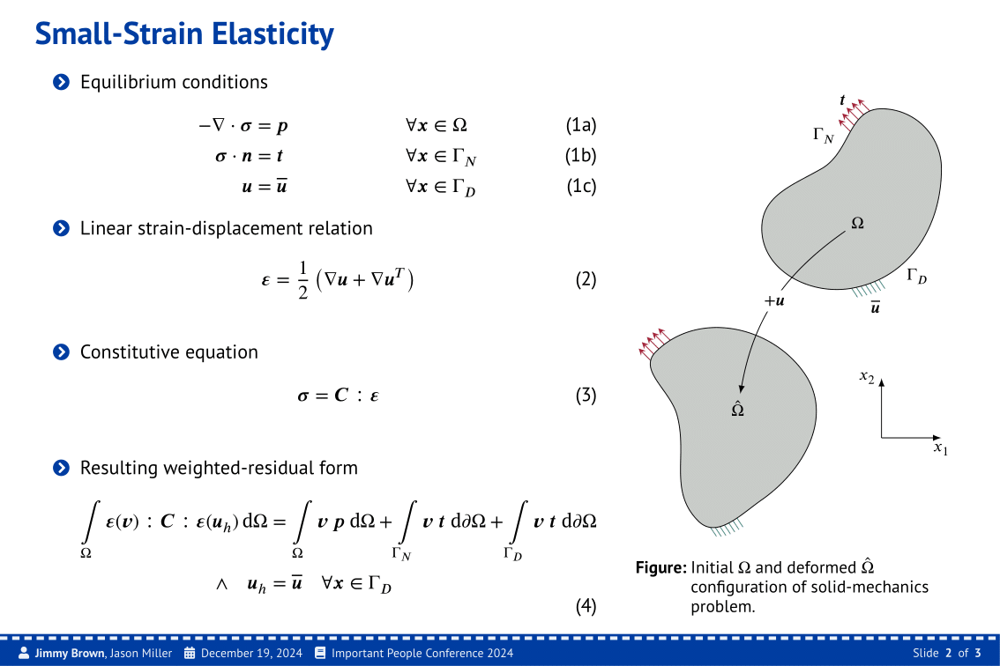
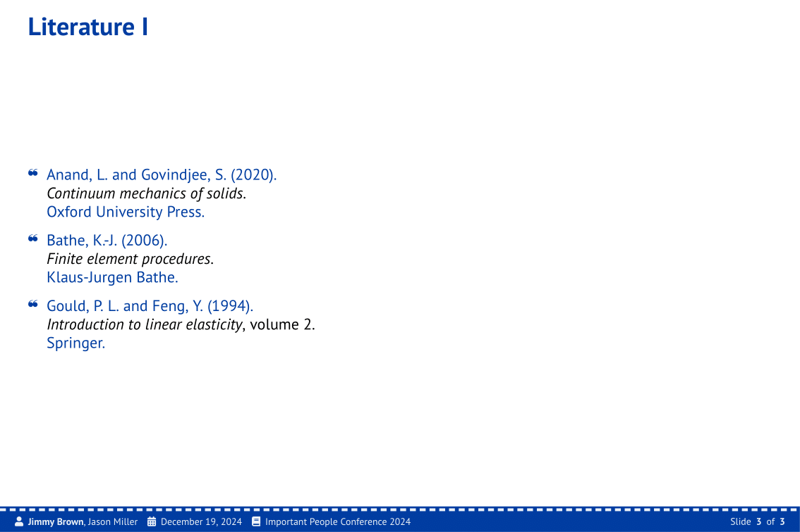

# A Simple yet Modern Theme for L<sup>A</sup>T<sub>E</sub>X Beamer

The key file of this theme is `beamerthememodern.sty` and can be applied by adding
```tex
\usetheme{modern}
```
to the preamble.
The theme file has to be located in the root directory of the document.
An example of the usage can be found in `master.tex`.
<p align = "center">
    <br>
     <br>
    <i>Screenshots of some sample slides using the theme.</i>
</p>
